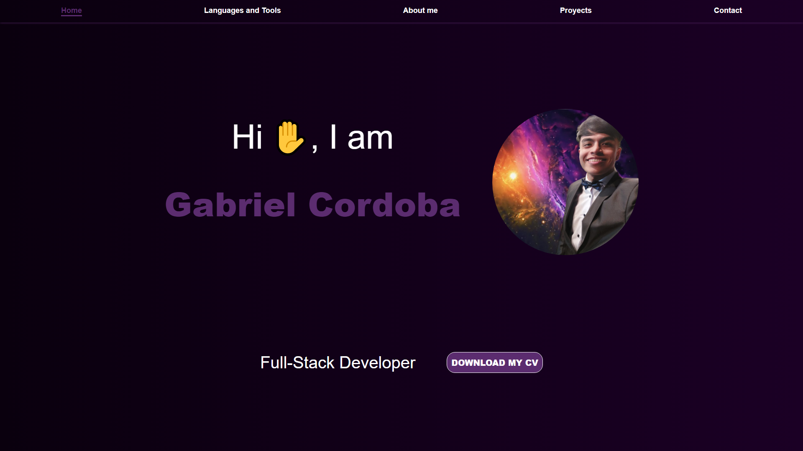
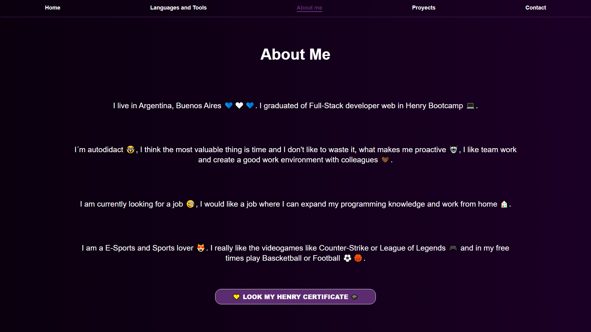
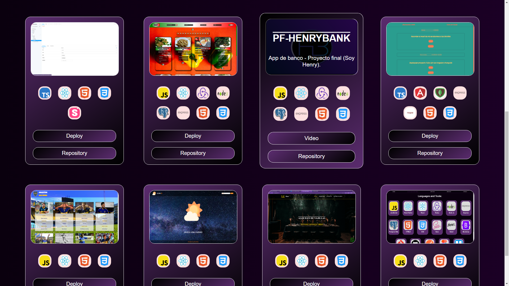
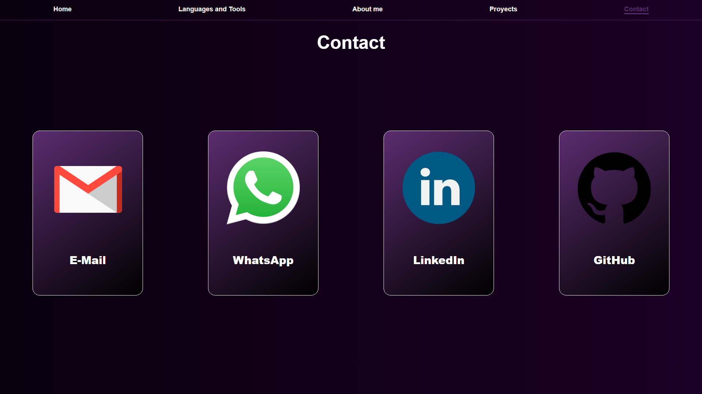

# Portafolio

Podras ejecutar este proyecto ejecutando este comando en consola `npm start`.   

### Es mi portafolio personal el cual contiene todo tipo de información sobre mí.

### Como lenguajes y tecnologías incorporadas, contacto, educación, cv y proyectos.

## Home

## Lenguajes y Tecnologías

## Sobre mí

## Proyectos

## Contacto

